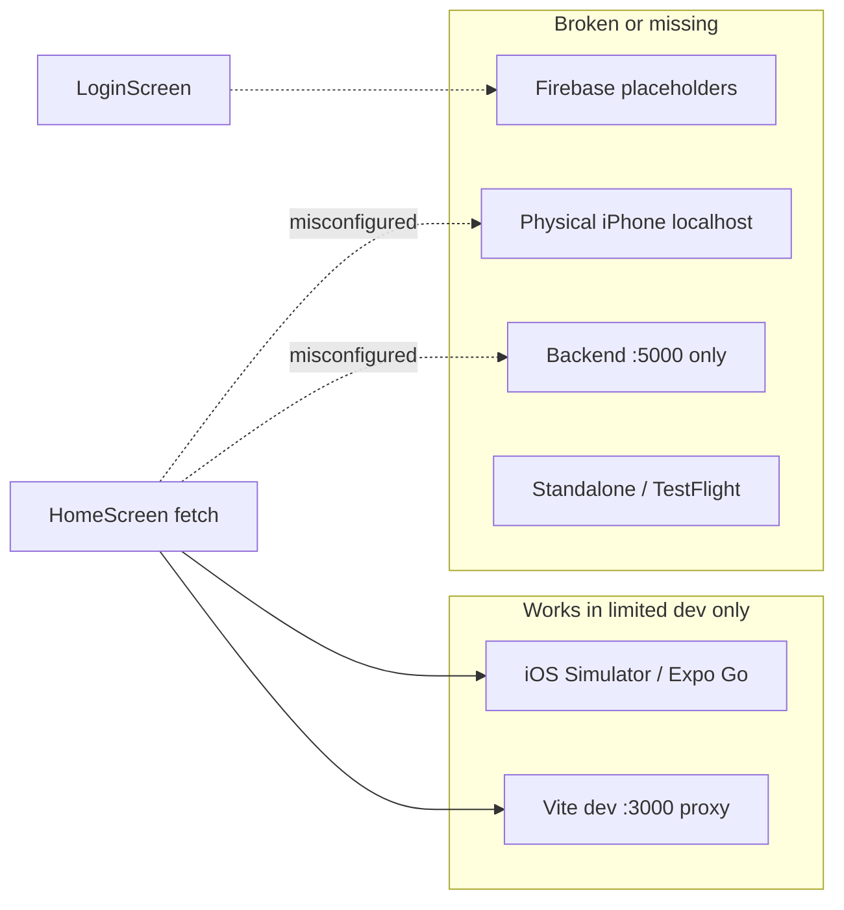

# iOS Compatibility Evaluation — Rumour Mobile

## Scope

This audit covers the **mobile** app at [`mobile/`](mobile/) (Expo 49 managed workflow). The **web** app in [`frontend/`](frontend/) is production-oriented; the **backend** at [`backend/src/index.js`](backend/src/index.js) serves `/api/buzzes` on port **5000**. There is **no `ios/` native project** in the repo (expected until `expo prebuild` or EAS Build).



---

## Verdict by environment

| Environment | Can launch UI? | Login works? | Buzzes API works? | Maps work? |
|-------------|----------------|--------------|-------------------|------------|
| **iOS Simulator + Expo Go** (deps installed, Firebase filled in, Vite on :3000) | Likely yes | Only after real Firebase config | Yes if Vite proxy running | Mostly (see maps section) |
| **iOS Simulator, backend only (:5000)** | Yes | After Firebase | **No** — mobile targets :3000 | Partial |
| **Physical iPhone** | Yes | After Firebase | **No** — `localhost` is the phone | Partial; HTTP/ATS risk |
| **Standalone / TestFlight build** | Not set up | N/A | N/A | N/A — no native iOS project or release config |

---

## Straight-up not working (must fix before real use)

### 1. Firebase Auth is placeholder-only

[`mobile/firebase.js`](mobile/firebase.js) uses `<YOUR_*>` literals. Login and signup in [`mobile/src/screens/LoginScreen.jsx`](mobile/src/screens/LoginScreen.jsx) will **always fail** until replaced.

The web app already uses env-driven config in [`frontend/src/firebase.js`](frontend/src/firebase.js); mobile has **no `EXPO_PUBLIC_*` or `.env` pattern** and [`.env.example`](.env.example) has no mobile vars.

### 2. Backend URL / port mismatch

Mobile defaults (iOS and [`app.json`](mobile/app.json) `extra.backendUrl`):

```44:54:mobile/src/screens/HomeScreen.jsx
  const defaultBackendUrl =
    ...
      : 'http://localhost:3000';
```

Backend actually listens on **5000**:

```86:87:backend/src/index.js
const PORT = process.env.PORT || 5000;
app.listen(PORT, () => console.log(`📡 [RUMOUR ENGINE] Transmitting on port ${PORT}`));
```

Port **3000** only works when the **Vite dev server** is running and proxying `/api` → 5000 ([`frontend/vite.config.js`](frontend/vite.config.js)). Running **backend alone** means iOS API calls fail with connection errors.

### 3. Physical iPhone cannot reach `localhost:3000`

On a real device, `localhost` refers to the **phone**, not your dev machine. [`mobile/README.md`](mobile/README.md) documents simulator-only behavior; there is **no LAN IP guidance** or dev-time override (e.g. `EXPO_PUBLIC_BACKEND_URL=http://192.168.x.x:5000`).

### 4. No install lockfile / unverified dependency tree

[`mobile/package.json`](mobile/package.json) exists but there is **no `mobile/package-lock.json`** (or `yarn.lock`). First `npm install` may resolve versions differently than intended; combined with **`react` 18.3.1** vs Expo 49’s typical **18.2.0**, you risk peer-resolution warnings or runtime issues on iOS.

---

## Incomplete or degraded on iOS

### 5. Google Maps provider on iOS without native setup

[`mobile/src/components/SignalMap.jsx`](mobile/src/components/SignalMap.jsx) forces `PROVIDER_GOOGLE` on all non-web platforms:

```40:40:mobile/src/components/SignalMap.jsx
        provider={Platform.OS !== 'web' ? PROVIDER_GOOGLE : undefined}
```

On iOS, Google Maps requires **API keys and native SDK config** (Expo config plugin / `app.json` `ios.config.googleMapsApiKey`). None of that exists. In Expo Go you may get Apple Maps fallback or blank/broken maps depending on build; for **standalone iOS**, this is a common failure point.

**Recommendation for iOS:** use default provider (omit `PROVIDER_GOOGLE` on `ios`) unless Google Maps is fully configured.

### 6. Missing iOS permission strings for standalone builds

[`mobile/app.json`](mobile/app.json) only sets `ios.supportsTablet`. There is **no**:

- `NSLocationWhenInUseUsageDescription` (required for `expo-location` in App Store builds)
- `expo-location` config plugin block

Expo Go may prompt at runtime; **TestFlight/App Store builds can crash or deny location** without plist text.

### 7. HTTP / App Transport Security (ATS)

All configured URLs use **`http://`**. iOS Simulator is lenient; **physical devices and release builds** often block cleartext unless `ios.infoPlist.NSAppTransportSecurity` exceptions are added or you use HTTPS.

### 8. Safe area / notch layout

[`mobile/App.jsx`](mobile/App.jsx) uses `SafeAreaView` from `react-native`, not `SafeAreaProvider` from `react-native-safe-area-context` (already in dependencies). On notched iPhones, headers/buttons may sit under the status bar or home indicator.

### 9. UI bugs that hurt iOS UX

- **`FlatList` inside `ScrollView`** in [`HomeScreen.jsx`](mobile/src/screens/HomeScreen.jsx) — triggers RN nested-scroll warnings; list may not scroll correctly on iOS.
- **`legendData` computed but never passed** to `ProfileLegend` — dead code; legend stays static.
- **`fetchBuzzes` assumes `data.buzzes` exists** — non-JSON or error responses can throw instead of showing a clean error.

### 10. Feature parity vs web (intentionally incomplete)

Mobile is a **thin scaffold** per root [`README.md`](README.md) (“scheduled for a comprehensive mobile rewrite”). Missing vs [`frontend/src/components/MapContainer.jsx`](frontend/src/components/MapContainer.jsx):

- Tiered proximity UI (ghost / aura / echo / hook / reveal)
- Secret event passwords (`isSecret`, `password`)
- Mapbox-based map (mobile uses `react-native-maps`, not Mapbox)
- Intel report, scanning animations, rich buzz detail modals
- [`HostReputation.jsx`](mobile/src/components/HostReputation.jsx) / [`ProfileLegend.jsx`](mobile/src/components/ProfileLegend.jsx) are **static placeholder copy** only

### 11. Expo Web target advertised but not wired

`npm run web` exists but **`react-native-web` and `react-dom` are not dependencies**; web is not a viable target without adding them.

### 12. Release pipeline missing

No `eas.json`, no bundle identifier, icons/splash assets, or `npx expo prebuild` output. **Cannot ship to TestFlight** from current repo state without additional Expo/EAS setup.

---

## What is in good shape for iOS (scaffold level)

- Expo 49 project with `"ios": "expo start --ios"` and `platforms` including iOS in [`app.json`](mobile/app.json)
- React Navigation stack + auth gate in [`App.jsx`](mobile/App.jsx)
- `expo-location` permission flow in [`HomeScreen.jsx`](mobile/src/screens/HomeScreen.jsx) (runtime prompt in Expo Go)
- `react-native-maps` markers, callouts, user location flags
- Android emulator host mapping (`10.0.2.2`) — iOS correctly uses `localhost` for **simulator-only** dev
- CORS-enabled backend — mobile `fetch` is not blocked by CORS on native

---

## Severity summary

| Severity | Items |
|----------|--------|
| **Blocker** | Firebase placeholders; wrong API port if Vite not running; physical device `localhost`; no release/native iOS project |
| **High** | `PROVIDER_GOOGLE` without iOS keys; missing location plist for standalone; HTTP/ATS on device |
| **Medium** | React version skew; no lockfile; SafeAreaProvider; FlatList-in-ScrollView; error handling in `fetchBuzzes` |
| **Low / product** | Web parity (tiers, secrets, Mapbox); stub reputation/legend; Expo Web deps |

---

## Minimal path to “working on iOS Simulator”

1. Copy Firebase config from web `.env` into `mobile/firebase.js` (or `EXPO_PUBLIC_*` + `app.config.js`).
2. Either run **Vite on :3000** *or* set `expo.extra.backendUrl` to `http://localhost:5000`.
3. `cd mobile && npm install && npm run ios` (Mac + Xcode simulator, or Expo Go on device with tunnel/LAN URL).
4. For **physical iPhone**, set backend URL to your machine’s LAN IP and port **5000** (or proxied 3000).

## Minimal path to “App Store ready”

1. Add `expo-location` plugin + `NSLocationWhenInUseUsageDescription`.
2. Fix maps (Apple Maps default or full Google Maps iOS setup).
3. HTTPS or ATS exceptions; `bundleIdentifier`, icons, EAS Build.
4. `npx expo prebuild` / EAS to generate `ios/` and signing.

---

## Conclusion

**iOS compatibility is “scaffold-level,” not production-ready.** The project can demo UI in **iOS Simulator + Expo Go** after Firebase and networking are configured, but **auth does not work today**, **API calls fail in common dev setups** (backend-only or physical device), and **standalone/TestFlight iOS is not implemented**. The web app remains the complete Rumour experience; mobile needs config fixes before feature parity work.
