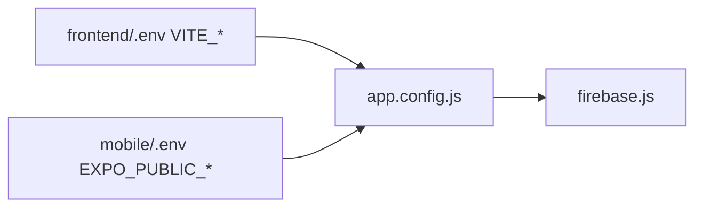

# Wire mobile Firebase env from web

## What was confusing

The web app stores secrets in [`frontend/.env`](frontend/.env) with the **`VITE_`** prefix (Vite requirement). The mobile app expects the same values under **`EXPO_PUBLIC_`** in [`mobile/.env`](mobile/.env). They are the **same Firebase project keys**, different variable names—nothing new to create in Firebase Console.

Your web file already has the four values mobile needs for Auth (same as [`frontend/src/firebase.js`](frontend/src/firebase.js)):

| Web (`frontend/.env`) | Mobile (`mobile/.env`) |
|----------------------|-------------------------|
| `VITE_FIREBASE_API_KEY` | `EXPO_PUBLIC_FIREBASE_API_KEY` |
| `VITE_FIREBASE_AUTH_DOMAIN` | `EXPO_PUBLIC_FIREBASE_AUTH_DOMAIN` |
| `VITE_FIREBASE_PROJECT_ID` | `EXPO_PUBLIC_FIREBASE_PROJECT_ID` |
| `VITE_FIREBASE_STORAGE_BUCKET` | `EXPO_PUBLIC_FIREBASE_STORAGE_BUCKET` |

`messagingSenderId` and `appId` are **not** in your web `.env` and are **not** required for email/password auth (web runs without them).

## Implementation

### 1. Create [`mobile/.env`](mobile/.env) (gitignored)

Copy from [`mobile/.env.example`](mobile/.env.example) and fill with values from [`frontend/.env`](frontend/.env):

```env
EXPO_PUBLIC_BACKEND_URL=http://localhost:5000

EXPO_PUBLIC_FIREBASE_API_KEY=<same as VITE_FIREBASE_API_KEY>
EXPO_PUBLIC_FIREBASE_AUTH_DOMAIN=<same as VITE_FIREBASE_AUTH_DOMAIN>
EXPO_PUBLIC_FIREBASE_PROJECT_ID=<same as VITE_FIREBASE_PROJECT_ID>
EXPO_PUBLIC_FIREBASE_STORAGE_BUCKET=<same as VITE_FIREBASE_STORAGE_BUCKET>
```

Leave `MESSAGING_SENDER_ID` / `APP_ID` empty unless you add them to Firebase console later.

### 2. Auto-sync in [`mobile/app.config.js`](mobile/app.config.js)

Load [`frontend/.env`](frontend/.env) and map `VITE_FIREBASE_*` → Expo `extra.firebase` when `EXPO_PUBLIC_*` is unset:

```js
require('dotenv').config({ path: path.resolve(__dirname, '../frontend/.env') });

const firebase = {
  apiKey: process.env.EXPO_PUBLIC_FIREBASE_API_KEY || process.env.VITE_FIREBASE_API_KEY || '',
  authDomain: process.env.EXPO_PUBLIC_FIREBASE_AUTH_DOMAIN || process.env.VITE_FIREBASE_AUTH_DOMAIN || '',
  // ...same pattern for projectId, storageBucket, messagingSenderId, appId
};
```

Load order: `../.env` → `mobile/.env` → `frontend/.env` (later files override earlier where both set).

This means **Expo works even if you only keep `frontend/.env`**, but `mobile/.env` will still be created so the original README step is satisfied.

### 3. Align required Firebase fields in [`mobile/firebase.js`](mobile/firebase.js)

Only warn when **`apiKey`, `authDomain`, or `projectId`** are missing (matching web). Do not treat empty `messagingSenderId` / `appId` as blocking—removes false warnings on startup.

### 4. Update docs

- [`mobile/README.md`](mobile/README.md): explain that values come from `frontend/.env` and list the name mapping table; note restart Expo after env changes (`npx expo start -c` if config seems stale).
- [`mobile/.env.example`](mobile/.env.example): add one-line comment pointing to `frontend/.env` as the source.

## After changes (your side)

```bash
cd backend && npm start
cd mobile && npx expo start -c
```

Login on mobile should use the same Firebase project as the web app.



## Security note

`mobile/.env` and `frontend/.env` stay gitignored (per [`.gitignore`](.gitignore)). No secrets committed to the repo.
