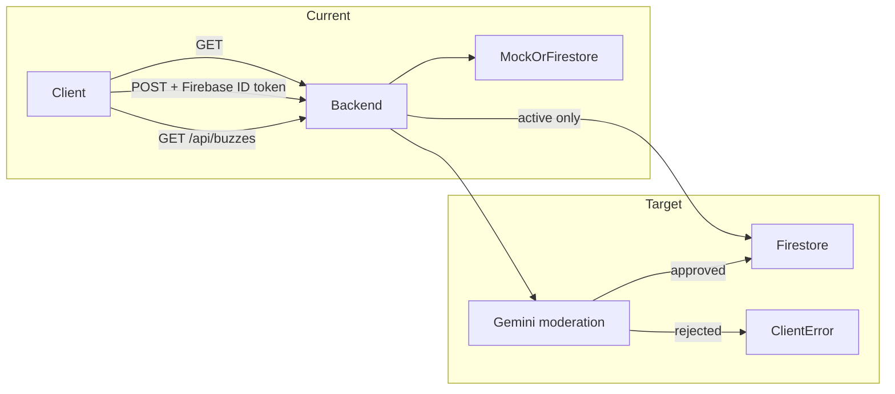
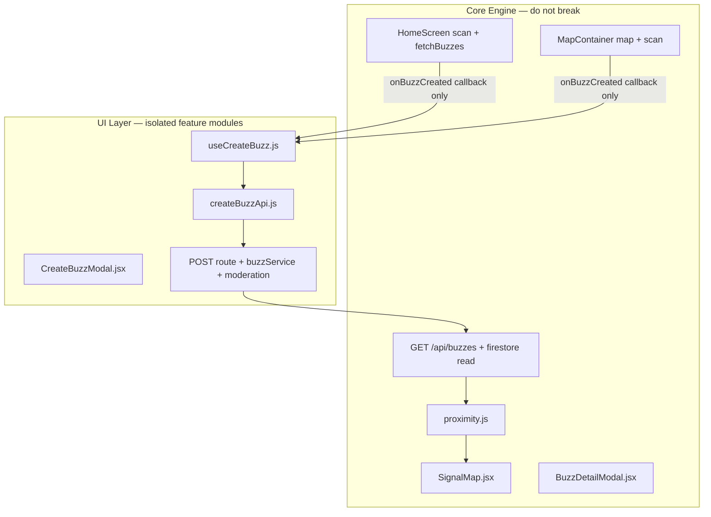
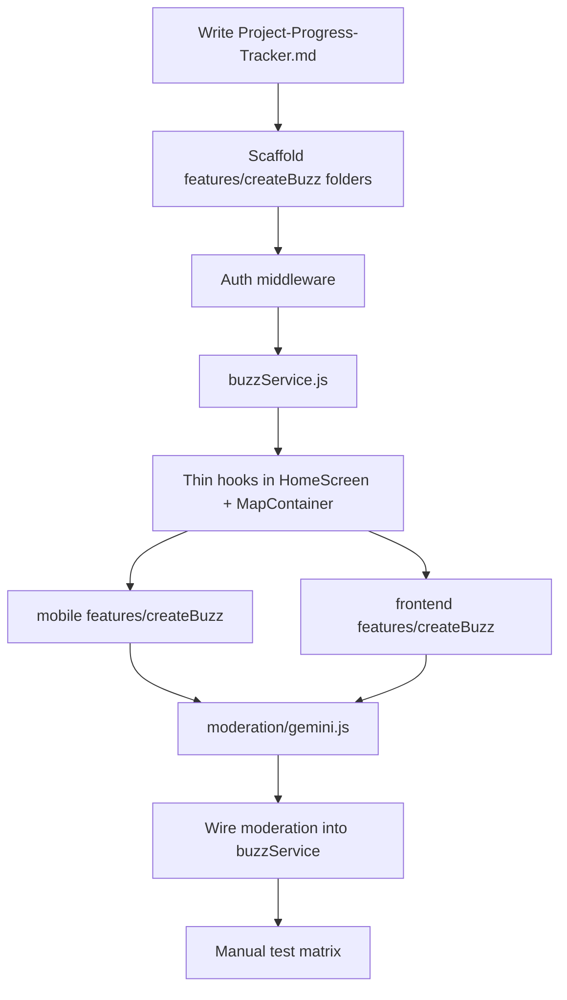

# User-Created Rumours + AI Moderation Plan

## Current state

The app is **read-only** today: clients call `GET /api/buzzes` ([backend/src/index.js](backend/src/index.js)), buzzes come from mock data or Firestore reads ([backend/src/firestore.js](backend/src/firestore.js)), and Firebase Auth gates the UI but **does not protect the API**. AI moderation is documented in [prodocs/Rumour-Plan.md](prodocs/Rumour-Plan.md) and [prodocs/Rumour-PRD(v0.1).md](prodocs/Rumour-PRD(v0.1).md) but `GOOGLE_AI_API_KEY` in [.env.example](.env.example) is unused.



---

## Deliverable: merged progress-tracker markdown

Create **`prodocs/Project-Progress-Tracker.md`** in the repo and **update** [c:\Users\onyrs\Desktop\missing_requirements.md](c:\Users\onyrs\Desktop\missing_requirements.md) with identical content.

### Document structure

1. **Project overview** — Bitirme delivery goals, link to brief
2. **Architecture snapshot** — monorepo layout, data flow diagram (above)
3. **Graduation docs checklist** (from existing Desktop file)
   - [ ] `prodocs/tech-stack.md`
   - [ ] `prodocs/DesignSystem.md`
   - [ ] `prodocs/Progress.md` (dev journal; separate from this tracker)
4. **Feature A: Start a Rumour** — phased checklist with owners/status columns
5. **Feature B: AI content moderation** — policy categories, integration steps, test cases
6. **Feature C (future): Community flagging** — 3-flag rule from PRD (out of scope for first pass, listed for tracking)
7. **Testing matrix** — manual scenarios per platform
8. **Environment setup** — `USE_MOCK=false`, Firebase service account, `GOOGLE_AI_API_KEY`
9. **Changelog / decision log** — dated entries as work completes

Each checklist item uses `- [ ]` / `- [x]` so GitHub and editors render progress.

Include a **"Core vs UI boundary"** section in the tracker listing which files are engine (do-not-break) vs feature UI (safe to iterate).

Include a **"Design & keyboard QA"** section with the checklist from §2.1 and mobile/web color token reference from §2.0.

---

## Architecture: Core engine vs UI layer

**Principle:** All new create-rumour and moderation UI lives in **dedicated feature modules**. Core discovery code (map, proximity tiers, scan, GET buzzes) stays untouched except for **one-line integration hooks**.



### Core engine files (minimal or zero edits)

| Layer | File | Role | Allowed change |
|-------|------|------|----------------|
| Mobile core | [mobile/src/lib/proximity.js](mobile/src/lib/proximity.js) | Distance, tiers, `processBuzzes` | **None** |
| Mobile core | [mobile/src/components/SignalMap.jsx](mobile/src/components/SignalMap.jsx) | Map markers | **None** |
| Mobile core | [mobile/src/components/BuzzDetailModal.jsx](mobile/src/components/BuzzDetailModal.jsx) | Detail view | **None** |
| Mobile core | [mobile/src/screens/HomeScreen.jsx](mobile/src/screens/HomeScreen.jsx) | Scan orchestration | **Only:** import create feature + `onSuccess={() => fetchBuzzes(location)}` |
| Web core | [frontend/src/components/MapContainer.jsx](frontend/src/components/MapContainer.jsx) | Map + scan | **Only:** import create feature + refresh callback |
| Backend core | [backend/src/firestore.js](backend/src/firestore.js) | Firestore init + read | **Only:** add `createBuzz()` export; keep `fetchBuzzesFromFirestore` signature stable |
| Backend core | [backend/src/index.js](backend/src/index.js) | App bootstrap | **Only:** mount new router; do not move mock/GET logic |

### New UI / feature files (all create + moderation work goes here)

**Mobile** — folder `mobile/src/features/createBuzz/`:

| File | Responsibility |
|------|----------------|
| `CreateBuzzModal.jsx` | Form UI, validation messages, loading/error states |
| `useCreateBuzz.js` | State machine: idle → submitting → success/error; calls API |
| `createBuzzApi.js` | `POST /api/buzzes` with Firebase ID token; no map/proximity imports |
| `createBuzzTypes.js` | Form defaults, type enum, max lengths (shared constants) |
| `index.js` | Single export: `CreateBuzzFeature` (modal + trigger button) |

**Web** — mirror structure at `frontend/src/features/createBuzz/` (same file names).

**Backend** — folder `backend/src/services/` + thin routes:

| File | Responsibility |
|------|----------------|
| `services/buzzService.js` | Validate body, proximity check, orchestrate moderation → Firestore write |
| `services/proximity.js` | Haversine helper (server-side 50m gate) — separate from client `proximity.js` |
| `moderation/gemini.js` | AI scan only |
| `middleware/auth.js` | Token verification only |
| `routes/buzzes.js` | HTTP mapping: `GET` delegates to existing read, `POST` delegates to `buzzService` |

### Integration contract (the only coupling surface)

Core screens pass **props only** — no create logic inlined:

```jsx
// HomeScreen.jsx — sole integration in core file
import { CreateBuzzFeature } from '../features/createBuzz';

<CreateBuzzFeature
  user={user}
  location={location}
  backendUrl={backendUrl}
  onSuccess={() => fetchBuzzes(location)}
/>
```

`CreateBuzzFeature` owns its own FAB/trigger, modal visibility, and form. If create UI breaks, map/scan/proximity still work.

### Tracker checklist items for separation

- [ ] Create `mobile/src/features/createBuzz/` scaffold (4–5 files + `index.js`)
- [ ] Create `frontend/src/features/createBuzz/` scaffold (mirror mobile)
- [ ] Create `backend/src/services/buzzService.js` — POST logic not in `index.js`
- [ ] Verify core files diff is ≤10 lines each (`HomeScreen`, `MapContainer`, `index.js`)
- [ ] Document boundary in `prodocs/Project-Progress-Tracker.md`

---

## Phase 1 — Backend: authenticated create API

**Goal:** Persist user buzzes in Firestore with auth and validation.

### 1.1 Extend Firestore schema

Add fields to `buzzes` documents (keep existing read shape for map compatibility):

| Field | Type | Notes |
|-------|------|-------|
| `creatorId` | string | Firebase UID |
| `host` | string | Auto-set from email/displayName (e.g. `@user`) |
| `createdAt` | Timestamp | Server time |
| `expiresAt` | Timestamp | Default `now + 4h` (per [prodocs/Rumour-Plan.md](prodocs/Rumour-Plan.md) §4.1) |
| `status` | enum | `active` \| `rejected` (only `active` returned from GET) |
| `moderationStatus` | enum | `pending` \| `approved` \| `rejected` |
| `moderationReason` | string? | User-safe rejection message |

Update `docToBuzz()` in [backend/src/firestore.js](backend/src/firestore.js) to pass through new fields and **filter** `status !== 'active'` / `moderationStatus === 'rejected'` on read.

### 1.2 Auth middleware

New file: `backend/src/middleware/auth.js` (HTTP only — no business logic)

- Read `Authorization: Bearer <Firebase ID token>`
- Verify with `firebase-admin` `verifyIdToken`
- Attach `req.user = { uid, email }`

### 1.3 POST `/api/buzzes` (thin route → service)

New files:
- `backend/src/routes/buzzes.js` — maps HTTP status codes only
- `backend/src/services/buzzService.js` — **all create validation and write logic**
- `backend/src/services/proximity.js` — server Haversine (independent of client engine)

**Request body** (aligned with existing mock shape):

```json
{
  "type": "Party",
  "title": "...",
  "teaser": "...",
  "description": "...",
  "zone": "...",
  "lat": 39.92,
  "lng": 32.85,
  "durationHours": 4,
  "isSecret": false,
  "password": null,
  "image": null
}
```

**Validation rules:**
- Required: `type`, `title`, `lat`, `lng`
- `title`/`teaser`/`description` max lengths (e.g. 80 / 120 / 500)
- `durationHours` clamped 1–6
- **Anti remote-posting:** server verifies `haversine(userLat, userLng, lat, lng) <= 50m` using coords sent in body (`userLat`, `userLng`) — matches plan §4.1
- Reject if Firestore unavailable when `USE_MOCK=false`

Wire route in [backend/src/index.js](backend/src/index.js) with one `app.use('/api/buzzes', buzzRouter)` line. Mock mode: `buzzService` appends to in-memory array — mock generator in `index.js` stays unchanged.

### 1.4 Client API helper (isolated per platform)

Each platform gets its own file — **not** mixed into core screens:

- `mobile/src/features/createBuzz/createBuzzApi.js`
- `frontend/src/features/createBuzz/createBuzzApi.js`

Both call the same endpoint; both use `getIdToken()` + device GPS. No imports from `proximity.js` or map components.

---

## Phase 2 — UI layer: Start a Rumour (mobile + web)

**Goal:** Authenticated users can publish a buzz at their current location — **entirely inside `features/createBuzz/`**, visually indistinguishable from existing Rumour screens.

### 2.0 Design language (mandatory — no new palette)

All create UI **must reuse existing tokens and patterns**. Do not introduce new hex values or Tailwind colors unless already used elsewhere in the app.

#### Mobile tokens — [mobile/src/theme/colors.js](mobile/src/theme/colors.js)

| Token | Value | Use |
|-------|-------|-----|
| `colors.background` | `#09090b` | Screen / input backgrounds |
| `colors.surface` | `#111827` | Cards (see LoginScreen) |
| `colors.surfaceElevated` | `#18181b` | Bottom sheet (see BuzzDetailModal) |
| `colors.border` | `#27272a` | Borders |

**Accent colors already in use** (type chips, CTAs, errors):

- Primary action / scan: `#22c55e` (green) — [HomeScreen.jsx](mobile/src/screens/HomeScreen.jsx) scan button
- Primary CTA button: white bg + black text — [LoginScreen.jsx](mobile/src/screens/LoginScreen.jsx)
- Muted text: `#a1a1aa`, `#cbd5e1`, `#71717a`
- Input border: `#3f3f46`; placeholder: `#9ca3af`
- Error / secret: `#ef4444`; success hook border: `#22c55e`
- Category dots: match [ProfileLegend](frontend/src/components/ProfileLegend.jsx) / map tier colors (pink Art, amber Music, cyan Gaming, etc.)

**Typography:** `fontWeight: '900'`, uppercase labels with `letterSpacing: 2–3`, italic titles where Login/Home use them.

**Modal shell:** Copy [BuzzDetailModal.jsx](mobile/src/components/BuzzDetailModal.jsx) bottom-sheet structure — `rgba(0,0,0,0.85)` overlay, `borderTopLeftRadius: 32`, `maxHeight: '92%'`. Do **not** use default white `Modal` backgrounds.

#### Web tokens — match Login + ProfileLegend

- Page/modal: `bg-zinc-900`, `bg-zinc-950/98`, `border-zinc-800`
- Inputs: `bg-zinc-800 border-zinc-700 rounded-xl focus:ring-2 focus:ring-white`
- Primary button: `bg-white text-black font-bold rounded-xl active:scale-95`
- Error banner: `border-red-500/60 bg-red-500/10 text-red-300` — [Login.jsx](frontend/src/Login.jsx)
- Panel accent strip: `bg-gradient-to-r from-green-400 via-cyan-300 to-blue-500` (optional header, as Field Protocol drawer)
- Rounded corners: `rounded-3xl` / `rounded-[2rem]` for cards

#### Shared UX copy tone

Match existing voice: "Start Signal", "Initiate Scan", short uppercase micro-labels, tactical/explorer feel — not generic "Create Post".

---

### 2.1 Keyboard awareness (mandatory — must work flawlessly)

Create form has **many TextInputs**; keyboard handling is a first-class requirement, not an afterthought.

#### Mobile — follow proven patterns (do not invent new approach)

**Reference implementations:**

1. Full-screen forms → [KeyboardAwareScroll.jsx](mobile/src/components/KeyboardAwareScroll.jsx) + [LoginScreen.jsx](mobile/src/screens/LoginScreen.jsx)
2. Bottom-sheet modals → [BuzzDetailModal.jsx](mobile/src/components/BuzzDetailModal.jsx) (lines 55–69, 230–245)

**CreateBuzzModal must use the BuzzDetailModal sheet pattern:**

- `Modal` + bottom sheet (`justifyContent: 'flex-end'`)
- `Keyboard` listeners: `keyboardWillShow` / `keyboardWillHide` on iOS, `keyboardDidShow` / `keyboardDidHide` on Android
- Apply `marginBottom: keyboardHeight` on sheet when keyboard open
- Inner `ScrollView` with:
  - `keyboardShouldPersistTaps="handled"`
  - `keyboardDismissMode="on-drag"`
  - `showsVerticalScrollIndicator={false}`
- All `TextInput`s: `keyboardAppearance="dark"`, `placeholderTextColor="#9ca3af"`
- Multi-field flow: `returnKeyType="next"` + `onSubmitEditing` to focus next field; last field `returnKeyType="done"`
- `onFocus` on lower fields: `scrollToEnd({ animated: true })` on the inner ScrollView (same as LoginScreen `scrollToActions`)
- `useSafeAreaInsets()` for bottom padding when keyboard hidden
- **Never** use white keyboard or white scroll areas — sheet bg stays `colors.surfaceElevated`

**Optional (inside feature folder only):** `mobile/src/features/createBuzz/useKeyboardInset.js` — extract listener logic so CreateBuzzModal stays readable; do **not** modify core `KeyboardAwareScroll` or `BuzzDetailModal`.

#### Web

- Modal body: `max-h-[90dvh] overflow-y-auto` so fields stay reachable on mobile browsers
- Root page pattern: `min-h-dvh` (see Login) if create is full-screen on small breakpoints
- Inputs already work with native scroll; ensure modal is not `overflow-hidden` without inner scroll

#### Keyboard QA checklist (tracker + before merge)

- [ ] iOS: focus last field (description) — field stays above keyboard
- [ ] iOS: drag sheet dismisses keyboard
- [ ] Android: same fields reachable; no sheet jump/flicker
- [ ] Android: `keyboardDidShow` padding correct
- [ ] Tap "Publish" while keyboard open — submit works (`keyboardShouldPersistTaps`)
- [ ] No white flash behind keyboard or in scroll bounce area
- [ ] Secret password field (if enabled) same behavior as BuzzDetailModal password input
- [ ] Web mobile viewport: all fields scrollable inside modal

---

### 2.2 Mobile feature module

**Do not** add create logic to [mobile/src/screens/HomeScreen.jsx](mobile/src/screens/HomeScreen.jsx) beyond mounting `<CreateBuzzFeature />`.

Inside `mobile/src/features/createBuzz/`:

- **`CreateBuzzModal.jsx`** — bottom-sheet form; **implements §2.0 design + §2.1 keyboard rules**
- **`useCreateBuzz.js`** — submit handler, error mapping (moderation vs network vs validation)
- **`createBuzzApi.js`** — HTTP client
- **`createBuzzStyles.js`** — shared StyleSheet using only `colors` + documented hex from §2.0 (keeps modal file small)
- **`index.js`** — exports `CreateBuzzFeature` (FAB + modal wrapper)

**FAB / trigger styling:** Match [HomeScreen](mobile/src/screens/HomeScreen.jsx) header buttons (`scanBtn` green border) or [fieldProtocolBtn](mobile/src/screens/HomeScreen.jsx) floating pill — green accent, dark surface, no new button style.

### 2.3 Web feature module

Same structure at `frontend/src/features/createBuzz/`. [MapContainer.jsx](frontend/src/components/MapContainer.jsx) only adds `<CreateBuzzFeature location={...} onSuccess={loadBuzzesFromBackend} />`.

Modal: fixed overlay `bg-black/70 backdrop-blur-xl`, panel `bg-zinc-950 border-zinc-800 rounded-[2rem]` — mirror [ProfileLegend.jsx](frontend/src/components/ProfileLegend.jsx) drawer panels.

### 2.4 UX rules

- Disable create if location permission denied or still locating
- Show countdown note: "Your signal expires in X hours"
- Creator sees their buzz on map after scan refresh (no real-time `onSnapshot` in MVP — fetch-on-scan is sufficient)

---

## Phase 3 — AI moderation (Gemini)

**Goal:** Block policy-violating content before it becomes visible on the map.

### 3.1 Backend moderation service

New file: `backend/src/moderation/gemini.js`

- Add dependency: `@google/generative-ai` in [backend/package.json](backend/package.json)
- Model: `gemini-2.0-flash` or `gemini-1.5-flash` (free tier; align with [prodocs/Rumour-Plan.md](prodocs/Rumour-Plan.md) §5.1)
- Function: `moderateBuzzContent({ title, teaser, description, zone, host })`

**Policy categories to scan** (document in tracker):

- Vulgar / obscene language
- Slurs and hate speech
- Racism and discriminatory content
- Harassment or threats
- PII (phone, email, address) — from PRD F5
- Commercial spam / ads — from PRD F5

**Prompt strategy:** Structured JSON response from Gemini:

```json
{ "approved": false, "categories": ["hate_speech"], "reason": "Contains slurs" }
```

Parse strictly; on API failure → **fail closed** (reject with generic message) or **fail open with `pending`** — recommend **fail closed** for graduation demo safety.

### 3.2 Integrate into POST pipeline (service layer only)

All steps live in `backend/src/services/buzzService.js` — **not** in routes or `index.js`:

1. Validate input + auth (route passes `req.user`)
2. Call `moderateBuzzContent` from `moderation/gemini.js`
3. If rejected → throw `ModerationError` → route returns `400`
4. If approved → `firestore.createBuzz()` with `status: 'active'`
5. GET path unchanged except read filter for rejected docs

**Security:** `GOOGLE_AI_API_KEY` stays server-only; never add to mobile/web env.

### 3.3 Test cases (document in tracker)

| Input | Expected |
|-------|----------|
| Clean event title/description | 201, appears on map |
| Obvious slur in title | 400, user-friendly rejection |
| Turkish + English mixed profanity | 400 |
| Phone number in description | 400 (PII) |
| Gemini API down | 503 or 400 fail-closed |

---

## Phase 4 — Firestore rules and ops (minimal)

- Firestore security rules: **deny client writes** to `buzzes` (all writes via backend Admin SDK)
- Document in tracker: set `USE_MOCK=false` + `FIREBASE_SERVICE_ACCOUNT_JSON` for persistence
- Optional seed script for test buzzes (future checklist item)

---

## Implementation order



Build `buzzService` + UI feature modules **without** AI first; add moderation inside `buzzService` only. Core engine regression test: map scan + tier display must pass with create feature disabled/removed.

---

## Key files to create or modify

### Documentation

| Action | File |
|--------|------|
| Create | `prodocs/Project-Progress-Tracker.md` (includes Core vs UI boundary section) |
| Update | `c:\Users\onyrs\Desktop\missing_requirements.md` (same content) |

### Backend — service layer (new)

| Action | File |
|--------|------|
| Create | `backend/src/middleware/auth.js` |
| Create | `backend/src/services/buzzService.js` |
| Create | `backend/src/services/proximity.js` |
| Create | `backend/src/moderation/gemini.js` |
| Create | `backend/src/routes/buzzes.js` |
| Modify | `backend/src/firestore.js` — add `createBuzz()` only; keep read API stable |
| Modify | `backend/src/index.js` — one router mount line |
| Modify | `backend/package.json` — `@google/generative-ai` |

### Mobile — UI feature module (new folder)

| Action | File |
|--------|------|
| Create | `mobile/src/features/createBuzz/index.js` |
| Create | `mobile/src/features/createBuzz/CreateBuzzModal.jsx` |
| Create | `mobile/src/features/createBuzz/useCreateBuzz.js` |
| Create | `mobile/src/features/createBuzz/createBuzzApi.js` |
| Create | `mobile/src/features/createBuzz/createBuzzTypes.js` |
| Create | `mobile/src/features/createBuzz/createBuzzStyles.js` |
| Create | `mobile/src/features/createBuzz/useKeyboardInset.js` (optional) |
| Modify | `mobile/src/screens/HomeScreen.jsx` — **≤5 lines:** import + `<CreateBuzzFeature />` |

### Web — UI feature module (new folder)

| Action | File |
|--------|------|
| Create | `frontend/src/features/createBuzz/` (mirror mobile structure) |
| Modify | `frontend/src/components/MapContainer.jsx` — **≤5 lines:** import + `<CreateBuzzFeature />` |

### Core engine — do not modify

`proximity.js`, `SignalMap.jsx`, `BuzzDetailModal.jsx`, mock generator in `index.js`, scan flow logic.

---

## Out of scope (tracked but not built now)

- Community **3-flag auto-delete** ([prodocs/Rumour-PRD(v0.1).md](prodocs/Rumour-PRD(v0.1).md) §4)
- Real-time `onSnapshot` feed
- Stripe Identity verification
- Image upload (URL field only if needed)

These remain unchecked items in the tracker for later phases.
