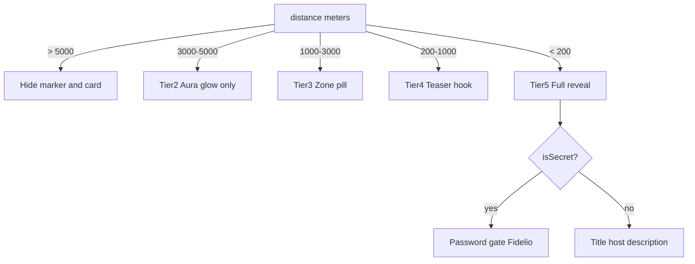
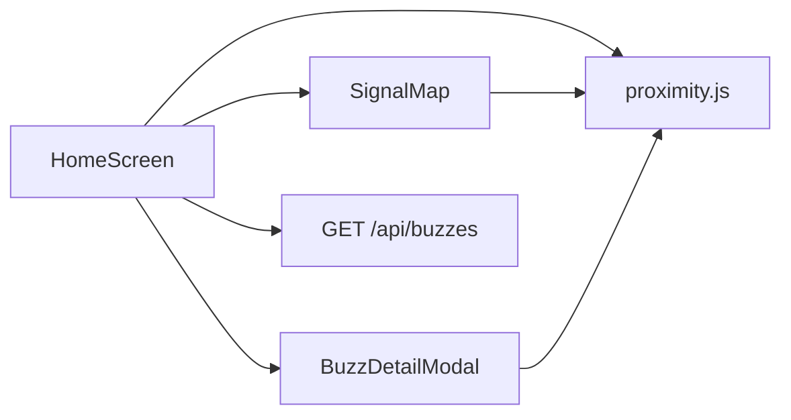

# Rumour-App — Full development roadmap

## Handoff validation (confirmed)

| Claim | Status |
|-------|--------|
| Backend mock API on `:5000`, lat/lng `0` allowed | Confirmed in [`backend/src/index.js`](backend/src/index.js) |
| Mobile defaults to `:5000` (not Vite `:3000`) | Confirmed in [`mobile/src/config/backendUrl.js`](mobile/src/config/backendUrl.js) + [`mobile/app.config.js`](mobile/app.config.js) |
| iOS uses Apple Maps; Android `PROVIDER_GOOGLE` | Confirmed in [`mobile/src/components/SignalMap.jsx`](mobile/src/components/SignalMap.jsx) |
| Mobile shows **unfiltered** buzz data | **Gap** — [`HomeScreen.jsx`](mobile/src/screens/HomeScreen.jsx) always renders `item.title` / `item.description`; [`SignalMap.jsx`](mobile/src/components/SignalMap.jsx) shows all markers with full callouts |
| Root README still says mobile “scheduled” | **Stale** — lines 8–10 of [`README.md`](README.md) |
| `mobile/assets/icon.png` missing | Only [`mobile/assets/README.md`](mobile/assets/README.md) exists |
| Firestore in stack but unused for buzzes | Auth only in [`frontend/src/firebase.js`](frontend/src/firebase.js) / [`mobile/firebase.js`](mobile/firebase.js); buzzes are 100% mock |

**Tier thresholds (product reference)** — implemented on web in [`MapContainer.jsx`](frontend/src/components/MapContainer.jsx) marker + modal logic:



---

## Phase 1 — Physical device test (verify before feature work)

**Goal:** Prove auth → location → `/api/buzzes` on a real iPhone (Windows dev machine; no local iOS simulator).

### Prerequisites

1. `cd backend && npm start` — confirm `http://<LAN_IP>:5000/api/health`
2. Windows firewall: allow inbound TCP **5000** on private network
3. Phone + PC on same Wi‑Fi

### Configure mobile

In [`mobile/.env`](mobile/.env) (gitignored):

```env
EXPO_PUBLIC_BACKEND_URL=http://<PC_LAN_IP>:5000
```

Get LAN IP: `ipconfig` → IPv4 on Wi‑Fi adapter. Restart: `cd mobile && npx expo start -c`.

### Test checklist

| Step | Expected |
|------|----------|
| Expo Go opens app | Login screen loads |
| Firebase sign-in | Same project as web (`frontend/.env` keys via `app.config.js`) |
| Grant location | Status card shows lat/lng |
| Home shows `API: http://192.168.x.x:5000` | Not `localhost` on physical device |
| Tap **Scan Nearby Buzzes** | 5+ cards (mock tiers at different offsets) |
| Map markers | Pins visible (currently **all** tiers — known parity gap) |
| Sign out | Returns to login |

### Failure modes (from code)

- `Failed to load nearby signals` + iOS hint when URL lacks `192.168` — [`HomeScreen.jsx`](mobile/src/screens/HomeScreen.jsx) L106–110
- `localhost` on phone hits the phone, not the PC — use LAN IP
- Env changes ignored until `npx expo start -c`

**Deliverable:** Short test log in [`mobile/README.md`](mobile/README.md) “Verified on device” section (date, device, LAN IP pattern) — optional but useful for next agent.

---

## Phase 2 — Mobile feature parity (largest engineering chunk)

**Reference implementation:** [`frontend/src/components/MapContainer.jsx`](frontend/src/components/MapContainer.jsx)  
**Targets:** [`mobile/src/screens/HomeScreen.jsx`](mobile/src/screens/HomeScreen.jsx), [`mobile/src/components/SignalMap.jsx`](mobile/src/components/SignalMap.jsx), new shared modules.

### 2a. Extract shared tier utilities

Add [`mobile/src/lib/proximity.js`](mobile/src/lib/proximity.js):

- `getDistanceInMeters` (move from HomeScreen — already duplicated vs web)
- `TIER = { GHOST: 5000, AURA: 3000, ECHO: 1000, HOOK: 200 }`
- `getTier(distance)` → `1 | 2 | 3 | 4 | 5`
- `getBuzzDisplay(buzz, { isUnlocked })` returning safe fields per tier:
  - **>5km:** exclude from lists/map (`visible: false`)
  - **3–5km:** type only (aura) — no title in list
  - **1–3km:** `zone` + type + icon
  - **200m–1km:** `teaser` + zone (no `title`/`description`/`host`)
  - **<200m:** full fields; if `isSecret && !isUnlocked` → masked title (“SECRET EVENT”), hide `description`/`host`/`image`

Reuse web color mapping from `getGlowStyle` / `categoryColor` patterns (RN: `View` circles + opacity, not Mapbox DOM).

### 2b. Map markers ([`SignalMap.jsx`](mobile/src/components/SignalMap.jsx))

Mirror web marker rules (L292–325):

- Skip `distance > 5000`
- Tier 2: large low-opacity circle `Marker` (or custom `View` marker if pinColor insufficient)
- Tier 3–4: callout shows zone/type only
- Tier 5: callout shows secret label or title; `onPress` opens detail flow

**Do not** add Mapbox to mobile for MVP parity — Apple/Google maps + styled markers match current stack and avoid new token/licensing on mobile.

### 2c. Buzz list + detail modal ([`HomeScreen.jsx`](mobile/src/screens/HomeScreen.jsx))

- Filter rendered cards with `getBuzzDisplay(...).visible`
- Card headline follows tier (zone / teaser / title / “SECRET EVENT”)
- Add `BuzzDetailModal` (React Native `Modal`):
  - Tier-based body (port web modal branches ~L508–545)
  - Password `TextInput` when `isSecret && distance < 200`; compare to `buzz.password` (case-sensitive, same as web)
  - Live countdown via `setInterval` (already have `formatTime`; add 1s tick like web L58–62)
  - Urgent timer styling when `< 1 hour` (red text)

### 2d. Scan UX + Intel report (should-have for parity)

Port lightweight versions from web scan flow (L52–55, L107–120, L350–360, L432+):

- `isScanning` + 2–3s delay before `fetchBuzzes` (sonar: `ActivityIndicator` + “Intercepting…” + `foundCount`)
- Post-scan **Intel Report** `Modal`: sorted list, closest first; tier-aware labels (`distance < 200 ? title : zone/type`) — same sorting already in `fetchBuzzes`

### 2e. Reuse existing components

- [`ProfileLegend.jsx`](mobile/src/components/ProfileLegend.jsx) — extend copy to mention 5 tiers if needed
- [`HostReputation.jsx`](mobile/src/components/HostReputation.jsx) — show `isVerifiedSource` badge on Tier 5 cards when unlocked

### Out of scope for this phase (defer)

- Mapbox on mobile
- Check-in flow (`isCheckedIn` on web)
- Full tactical CSS sonar (use RN animation approximations)



---

## Phase 3 — Real data (Firestore persistence)

**Current state:** Buzzes generated in-memory in [`backend/src/index.js`](backend/src/index.js); no `getFirestore` anywhere.

**Recommended MVP path** (aligns with [`.github/copilot-instructions.md`](.github/copilot-instructions.md) and PRD ephemeral events):

### 3a. Data model (Firestore `buzzes` collection)

```js
{
  type, title, lat, lng, zone?, teaser?, description?, host?,
  icon?, image?, isSecret?, password?, isVerifiedSource?,
  expiresAt: Timestamp,
  createdAt, createdBy: uid
}
```

- TTL: Firestore TTL policy on `expiresAt` (or scheduled cleanup Cloud Function if TTL unavailable on plan)
- Geo queries: for MVP, keep **client-side distance sort** after bounding-box query OR continue server mock until geoindex added

### 3b. Backend evolution (minimal breaking change)

Extend [`backend/src/index.js`](backend/src/index.js):

1. `firebase-admin` init from env (`FIREBASE_*` in [`.env.example`](.env.example))
2. `GET /api/buzzes` — if `USE_MOCK=true` (default dev), keep `generateDynamicMockData`; else read active docs, filter `expiresAt > now`, return same JSON shape
3. Later: `POST /api/buzzes` (auth middleware via Firebase ID token) for host creation

### 3c. Clients

- Web/mobile keep existing fetch; no contract change if response shape preserved
- Auth already via Firebase — add ID token header when POST exists

### 3d. Migration note

PRD MVP mentions **100m** geofence; product/handoff uses **5-tier 200m–5km**. **Keep 5-tier thresholds** unless product explicitly revises — document in README when implementing Firestore rules.

---

## Phase 4 — Release (EAS + iOS)

**Current:** [`mobile/eas.json`](mobile/eas.json) has `development` / `preview` / `production` profiles; no `icon`/`splash` in [`mobile/app.config.js`](mobile/app.config.js).

### Steps

1. Add `assets/icon.png` (1024×1024) and `assets/splash.png` per [`mobile/assets/README.md`](mobile/assets/README.md)
2. Update [`mobile/app.config.js`](mobile/app.config.js):

```js
icon: './assets/icon.png',
splash: { image: './assets/splash.png', resizeMode: 'contain', backgroundColor: '#09090b' },
```

3. `npm i -g eas-cli` → `eas login` → `eas build:configure` (if needed)
4. **Preview internal:** `eas build --profile preview --platform ios` (device install via EAS link)
5. **TestFlight:** Apple Developer account → `eas build --profile production --platform ios` → `eas submit --platform ios`
6. Production `EXPO_PUBLIC_BACKEND_URL` → hosted API URL (not LAN IP); set EAS secrets for Firebase vars

**Windows constraint:** No local `ios/` folder or simulator — EAS cloud builds are the correct path (already noted in handoff).

---

## Phase 5 — Documentation

Update [`README.md`](README.md):

- Replace “mobile rewrite scheduled” (L8–10) with pointer to [`mobile/README.md`](mobile/README.md)
- Add **Run** table matching handoff (backend 5000, web 3000, mobile Expo)
- Note Windows + physical iPhone workflow
- Clarify buzz data is **mock** until Phase 3

Optional: one-line sync in [`.env.example`](.env.example) if new backend flags added (`USE_MOCK`, `FIREBASE_SERVICE_ACCOUNT`).

---

## Suggested execution order

| Order | Phase | Effort | Blocks |
|-------|-------|--------|--------|
| 1 | Physical device test | ~1 hour | Validates env before parity work |
| 2 | Mobile parity (2a→2e) | 2–4 days | Core product on mobile |
| 3 | README (5) | ~30 min | Can land anytime after Phase 1 |
| 4 | Firestore (3) | 2–5 days | Independent of mobile UI |
| 5 | EAS release (4) | ~1 day + Apple review wait | Needs icons + stable API URL |

---

## Risk register

| Risk | Mitigation |
|------|------------|
| Windows firewall blocks phone → backend | Document `ipconfig` + firewall rule in Phase 1 |
| Tier 2 “aura” hard on RN Maps | Custom marker `View` with large `borderRadius` + low opacity |
| Secret passwords in mock JSON | Accept for demo; never store plaintext passwords in Firestore for production |
| MVP doc says 100m vs 5-tier | Keep web/mobile tier math consistent; update PRD footnote when persisting |
